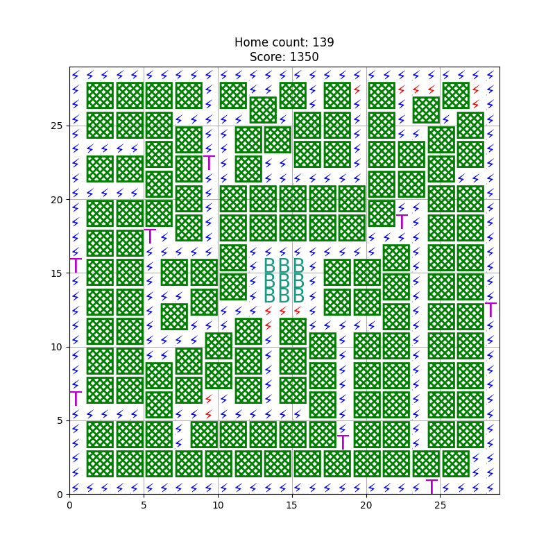
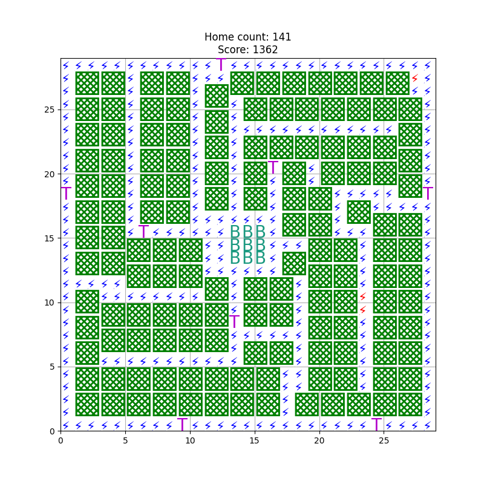

# GeneticAlgoritm
#### Problem
Find optimal city plan
#
## Evolution mechanics implemented
* Clone

    Random areas of board are cloned from target to current agent

* Swap 

    Random areas positions are swaped inside agent
    
* Shuffle

    In random positions random elements are places
    
Evolutions are rejected if they decrease score, only swap persists.


* Drop out
    
    Every agent has chance to not survive. At each epoch, 10% of population is removed and replaced with new random agents. 
### Results

My algorithm could reach only 139, while best solution known to me is 141, it is very good score.




#### Legend:
Tower - power

Bank - always in center

Homes - green are good, black has no reach, red has no power


#### Old score reploted




### Setup
```
conda create -n genetic python=3.8
conda activate genetic
pip install -r requrements.txt
```
#### Next steps
Add outer line for 'real' electricity input, it will make problem harder.
