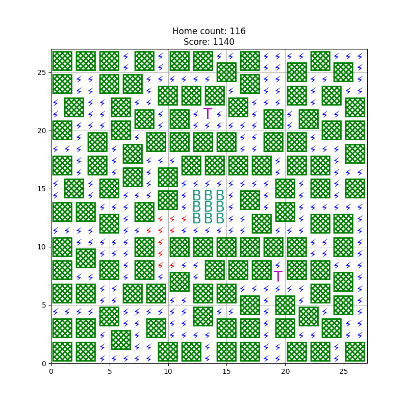
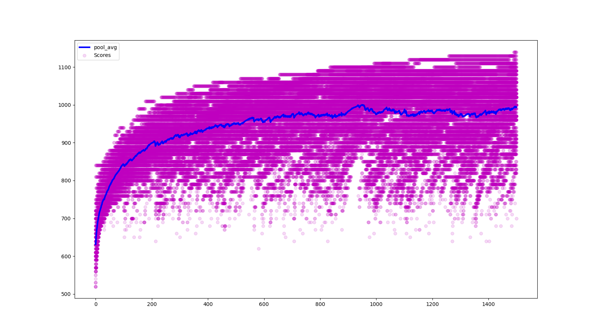

# GeneticAlgoritm
####Problem
Find optimal city plan
#
## Evolution mechanics implemented
* Clone

    Random areas of board are cloned from target to current agent

* Swap 

    Random areas positions are swaped inside agent
    
* Shuffle

    In random positions random elements are places
    
All evolutions are rejected if they decrease score

* Drop out
    
    Every agent has chance to not survive. At each epoch, 10% of population is removed and replaced with new random agents. 
### First results
Best home from fun.




#### Legend:
Tower - power
Bank - always in center
Homes - green are good, black has no path reach, red has no power


### Requriements
```
conda create -n genetic python=3.8
conda activate genetic
pip install -r requrements.txt
```
#### Next steps
Add outer line for 'real' electricity input, it will make problem harder.